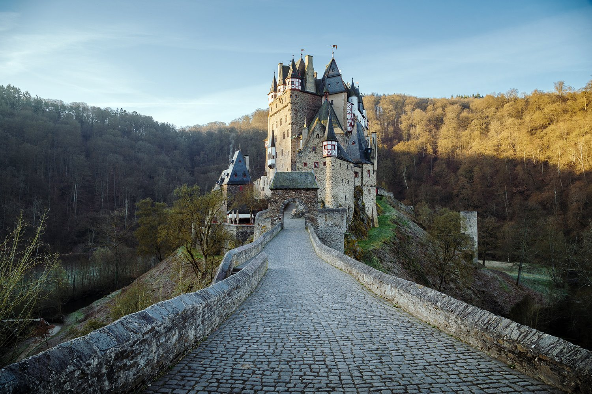

<html>
 <head>
 </head>
 <body>
  <h1>Lugares más visitados</h1>
<h2>Castillo de Eltz en Alemania</h2>

Es lo más parecido a la multipropiedad vacacional pero en el campo de los castillos, y es que esta construcción medieval pertenecía a más de una familia. Conforme se quedaban sin espacio iban construyendo nuevas salas y torres que recibían el nombre de la familia en cuestión. El castillo de Eltz se alza entre colinas, encaramado en una espectacular roca, a 70 metros sobre el río Mosela.

 

<h3>Saumur, a orillas del Loira</h3>

De la cincuentena de castillos que orlan las orillas del Loira, el de Saumur es uno de los más antiguos y posiblemente el que tenga una apariencia más medieval. Ubicado a las afueras de la ciudad homónima, su silueta, se divisa desde varios kilómetros a la redonda. Se construyó en el siglo XIV sobre los restos de una fortaleza anterior y fue residencia de los duques de Anjou.
 

 

<h4>La Laguna azul, Islandia </h4>

La Laguna Azul es un spa geotérmico natural hundido en un campo de lava y es conocido por sus aguas curativas ricas en minerales. Las familias deben tener cuidado, ya que los niños menores de 2 años no están permitidos en las piscinas. Además, los niños entre 2 y 8 años deben usar flotadores.

<h5>La Gran Pirámide de Giza, Egipto </h5>

Puede ser sorprendente saber que un desierto desolado en el Medio Oriente se ha convertido en una de las mejores atracciones turísticas del mundo, a menos que consideres que muchas personas desean desesperadamente visitar la Gran Pirámide de Giza, una de las 7 maravillas oficiales del mundo antiguo. La tumba que fue construida alrededor de 2500 a.C. ahora es responsable de recibir más de 14.7 millones de visitantes por año.

Si desea saber sobre otros lugares más visitado en el mundo puede visitar esta página

<a href="https://www.skyscanner.es/noticias/estos-son-los-10-lugares-turisticos-mas-visitados-del-mundo">This is a link</a>
</body>
</html>

